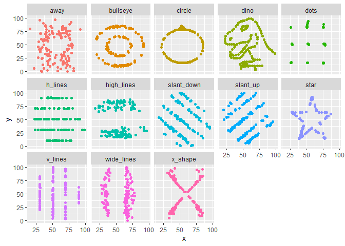

Lab 01 - Hello R
================
Robert Link
07/05/2021

## Load packages and data

``` r
library(tidyverse) 
library(datasauRus)
```

## Exercises

### Exercise 1

The `datasaurus_dozen` file contains 1846 rows and 3 columns.

The three variables are: `dataset`,`x-values`, and `y-values`.

### Exercise 2

First let’s plot the data in the dino dataset:

``` r
dino_data <- datasaurus_dozen %>%
  filter(dataset == "dino")

ggplot(data = dino_data, mapping = aes(x = x, y = y)) +
  geom_point()
```

<!-- -->

And next calculate the correlation between `x` and `y` in this dataset:

``` r
dino_data %>%
  summarize(r = cor(x, y))
```

    ## # A tibble: 1 x 1
    ##         r
    ##     <dbl>
    ## 1 -0.0645

### Exercise 3

We would also like to plot the data in the star dataset:

``` r
star_data <- datasaurus_dozen %>%
  filter(dataset == "star")

ggplot(data = star_data, mapping = aes(x = x, y = y)) +
  geom_point()
```

<!-- -->

And as before, we calculate the correlation between `x` and `y` in this
dataset:

``` r
star_data %>%
  summarize(r = cor(x, y))
```

    ## # A tibble: 1 x 1
    ##         r
    ##     <dbl>
    ## 1 -0.0630

### Exercise 4

Now we do the exact same thing to the circle dataset.

``` r
circle_data <- datasaurus_dozen %>%
  filter(dataset == "circle")

ggplot(data = circle_data, mapping = aes(x = x, y = y)) +
  geom_point()
```

<!-- -->

``` r
circle_data %>%
  summarize(r = cor(x, y))
```

    ## # A tibble: 1 x 1
    ##         r
    ##     <dbl>
    ## 1 -0.0683

Notice now that the correlations are not identical, but are reasonably
close for the three data sets explored: `dino`, `star`, and `circle`.

### Exercise 5

Now we plot all 13 datasets.

``` r
ggplot(datasaurus_dozen, aes(x = x, y = y, color = dataset))+
  geom_point()+
  facet_wrap(~ dataset, ncol = 5) +
  theme(legend.position = "none")
```

<!-- -->

And we produce all correlations.

``` r
datasaurus_dozen %>%
  group_by(dataset) %>%
  summarize(r = cor(x, y)) %>%
  print(13)
```

    ## # A tibble:
    ## #   13 x 2
    ##    dataset   
    ##    <chr>     
    ##  1 away      
    ##  2 bullseye  
    ##  3 circle    
    ##  4 dino      
    ##  5 dots      
    ##  6 h_lines   
    ##  7 high_lines
    ##  8 slant_down
    ##  9 slant_up  
    ## 10 star      
    ## 11 v_lines   
    ## 12 wide_lines
    ## 13 x_shape   
    ## # ... with 1
    ## #   more
    ## #   variable:
    ## #   r <dbl>
