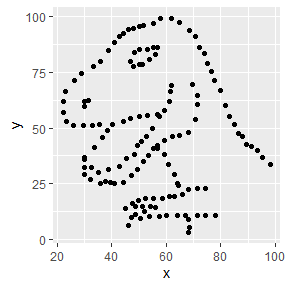
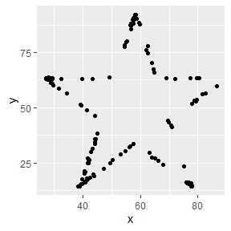
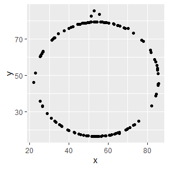

Lab 01 - Hello R
================
Robert Link
07/05/2021

## Load packages and data

``` r
library(tidyverse) 
library(datasauRus)
```

## Exercises

### Exercise 1

The `datasaurus_dozen` file contains 1846 rows and 3 columns.

The three variables are: `dataset`,`x-values`, and `y-values`.

### Exercise 2

The answers for this Exercise are given for you below. But you should
clean up some of the narrative so that it only includes what you want to
turn in.

First let’s plot the data in the dino dataset:

``` r
dino_data <- datasaurus_dozen %>%
  filter(dataset == "dino")

ggplot(data = dino_data, mapping = aes(x = x, y = y)) +
  geom_point()
```

<!-- -->

And next calculate the correlation between `x` and `y` in this dataset:

``` r
dino_data %>%
  summarize(r = cor(x, y))
```

    ## # A tibble: 1 x 1
    ##         r
    ##     <dbl>
    ## 1 -0.0645

### Exercise 3

We would also like to plot the data in the star dataset:

``` r
star_data <- datasaurus_dozen %>%
  filter(dataset == "star")

ggplot(data = star_data, mapping = aes(x = x, y = y)) +
  geom_point()
```

<!-- -->

And as before, we calculate the correlation between `x` and `y` in this
dataset:

``` r
star_data %>%
  summarize(r = cor(x, y))
```

    ## # A tibble: 1 x 1
    ##         r
    ##     <dbl>
    ## 1 -0.0630

### Exercise 4

Now we do the exact same thing to the circle dataset.

``` r
circle_data <- datasaurus_dozen %>%
  filter(dataset == "circle")

ggplot(data = circle_data, mapping = aes(x = x, y = y)) +
  geom_point()
```

<!-- -->

``` r
circle_data %>%
  summarize(r = cor(x, y))
```

    ## # A tibble: 1 x 1
    ##         r
    ##     <dbl>
    ## 1 -0.0683

Notice now that the correlations are not identical, but are reasonably
close for the three data sets explored: `dino`, `star`, and `circle`.

### Exercise 5

Add code and narrative as needed.

To add R chunks either type out the backticks, curly braces, and the
letter `r` or use the Insert chunk button above, green C+.
